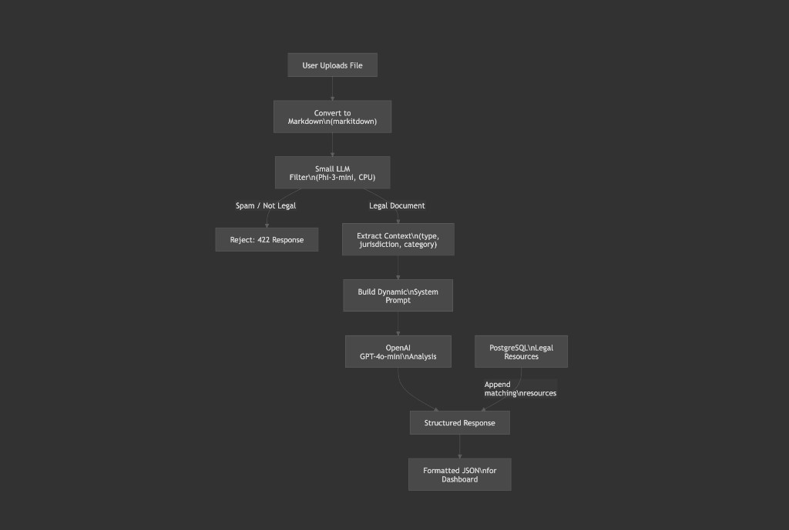

# Legal Shield

**Turns complex legal documents into plain-English explanations. Understand what you're signing and decide with confidence.**

Legal Shield is an AI-powered legal assistant built for **AfroPix 2026**. It helps users understand legal documents in plain language, highlights risk areas, and connects them with local lawyers or legal clinics by category and location.

---

## What it does

- **AI document analyzer** — Upload a document (PDF, Word, or text). Get a plain-language summary, risk tiers (good / medium / high), and highlighted clauses.
- **Legal risk dashboard** — Risk and complexity scores on a 1–10 scale so you can see at a glance what needs attention.
- **Local impact connector** — Find lawyers and legal clinics by state and category (Housing, Employment, Family, Consumer, Immigration, etc.) via the Pro Bono Net Legal Organizations API, with curated fallback data.
- **Smart gating** — The app checks that uploads are actually legal-style documents and rejects spam or off-topic content with a clear message.

---

## Architecture Overview

The backend pipeline: convert the upload to markdown, classify it with a small LLM (or heuristics), then either reject non-legal content or analyze with OpenAI and append matching legal resources for the dashboard.



---

## Built with

**Languages:** Python, TypeScript  

**Frameworks:** Next.js (App Router), React 19, FastAPI, Tailwind CSS  

**Libraries & tools:** MarkItDown (document conversion), Lucide React (icons), Pydantic, httpx, Pillow, pytesseract  

**APIs & services:** OpenAI API (GPT-4o-mini), OpenRouter (optional classifier), Pro Bono Net Legal Organizations API  

**AI / ML:** OpenAI GPT-4o-mini (analysis), llama-cpp-python with Phi-3-mini GGUF or OpenRouter (optional on-CPU classifier), heuristic fallbacks when no model or keys are set  

**Runtime:** Node.js, Uvicorn  

---

## Project structure

```
Legal shield/
├── README.md                 # This file
├── package.json              # Next.js frontend
├── .env.example               # Frontend env (e.g. BACKEND_URL)
├── backend/                  # FastAPI backend
│   ├── README.md             # Backend setup & classifier options
│   ├── app/
│   │   ├── api/              # Analyze, resources routes
│   │   ├── services/         # Converter, classifier, analyzer
│   │   ├── db/               # DB and legal resources
│   │   └── ...
│   ├── requirements.txt
│   └── .env.example          # OPENAI_API_KEY, OPENROUTER_API_KEY, etc.
├── doc/
│   ├── Project-Story.md      # Hackathon story (inspiration, how we built it, etc.)
│   └── Hackathon.canvas      # Pipeline diagram
└── assets/
    └── legal-shield-logo.png # Project logo
```

---

## Getting started

### 1. Backend (Python)

```bash
cd backend
python3 -m venv .venv
source .venv/bin/activate   # On Windows: .venv\Scripts\activate
pip install -r requirements.txt
cp .env.example .env
```

Edit `backend/.env` and set:

- `OPENAI_API_KEY` — your OpenAI key (for document analysis)
- `OPENROUTER_API_KEY` — (optional) OpenRouter key for document classification. If unset, the backend uses a local Phi-3 GGUF model or keyword heuristics.

Run the API:

```bash
python -m uvicorn app.main:app --reload --port 8000
```

API docs: **http://localhost:8000/docs**

### 2. Frontend (Next.js)

From the **project root** (where this README is):

```bash
npm install
npm run dev
```

Open **http://localhost:3000**.

If the frontend runs on a different host/port than the backend, set `BACKEND_URL` in the frontend (e.g. in `.env.local`) to point to your backend (e.g. `http://localhost:8000`). See `backend/README.md` for classifier options, optional Tesseract OCR, and local GGUF model setup.

---

## Environment summary

| Where       | Variable            | Purpose |
|------------|---------------------|--------|
| Backend    | `OPENAI_API_KEY`    | Required for document analysis (GPT-4o-mini). |
| Backend    | `OPENROUTER_API_KEY`| Optional; used for document classification. If missing, uses local GGUF or heuristics. |
| Backend    | `ALLOWED_ORIGINS`   | CORS origins (default `http://localhost:3000`). |
| Frontend   | `BACKEND_URL`       | Optional; backend base URL when not same-origin (required when frontend is on Vercel). |

---

## Deploying

- **Frontend (Vercel):** Deploy this repo to [Vercel](https://vercel.com).
  - **Root Directory** must be **`.`** (repo root) or empty—the Next.js app and `src/app/api/` live at the root. If you see 404 for `/api/analyze`, set Root Directory to `.` and redeploy.
  - Add **`BACKEND_URL`** (your backend URL, e.g. `https://legal-shield-backend-3d56.onrender.com`) in Project → Settings → Environment Variables for **Production**, then **Redeploy**.
- **Backend:** Deploy `backend/` to [Railway](https://railway.app), [Render](https://render.com), or [Fly.io](https://fly.io). Ensure `OPENAI_API_KEY` (and optionally `OPENROUTER_API_KEY`) and `ALLOWED_ORIGINS` are set for production.

---

## Project story

For the full hackathon narrative—inspiration, how we built it, challenges, accomplishments, and what’s next—see **[doc/Project-Story.md](doc/Project-Story.md)**.

---

## Disclaimer

Legal Shield provides **educational insights** and is **not legal advice**. Always consult a qualified attorney for legal decisions.
